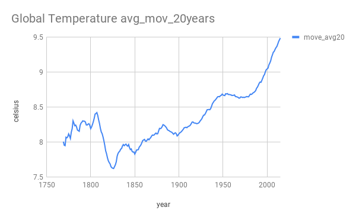
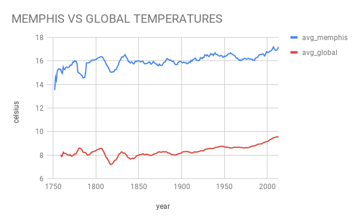

# Explore Weather Trends

### Summary

This project is a practice of SQL and data analysis. The project analyzes the local temperature data and the global temperature data and compares the temperature trends.

 
### Steps taken in the project

* Data was extracted from the database using SQL.

`Find the closer city in database:`
~~~~
SELECT *
FROM city_list
WHERE city IN ('Memphis')
~~~~
`Extract local data from database:`
~~~~
SELECT c.year, c.avg_temp
FROM city_data as C
WHERE city IN ('Memphis')
~~~~

`Extract global data from database:`
~~~~
SELECT *
FROM global_data
~~~~
* Total temperature averages, maximus and minimus were extracted from the database using SQL.

`Calculate average total, maximus and minimus of Memphis temperatures.`
~~~~
SELECT AVG(avg_temp), MAX(avg_temp), MIN(avg_temp)
FROM city_data
WHERE city IN ('Memphis') AND avg_temp IS NOT NULL
~~~~
`Calculate average total, maximum and minimum of global temperatures.`
~~~~
SELECT AVG(avg_temp), MAX(avg_temp), MIN(avg_temp)
FROM global_data
WHERE  avg_temp IS NOT NULL
~~~~
* The data extracted from the database was imported into Google documents.
* A line chart was created to perform the analysis of the data. And two moving averages were made to have a better temperature display. The first was grouped in 10 years and the second in 20 years.

### Observations

* The average temperature in the city where I live in Memphis is hotter than the average global temperature.
* The average temperature in Memphis has not been constant have a tendency to go up slowly and with a sharp drop around 1820.
* The changes observed in the temperature of my city compared to the changes in the global temperature have similarities both have a temperature drop for the same dates and the two present a tendency to raise their temperature.
* The trend in the last 100 years is towards high, reaching temperatures never before seen in previous years, this is observed in both local and global temperatures.